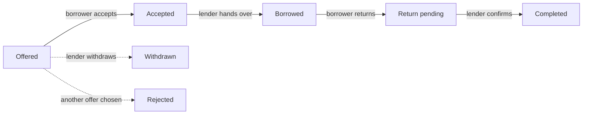

<div align="center">


# CampusShare

**Share today, help tomorrow.**

A peer-to-peer lending platform for university students. You can borrow a calculator instead of buying one you'll use once.

### 🌐 [Live demo: campusshare-8594.onrender.com](https://campusshare-8594.onrender.com)

</div>

---

## The problem

Every semester the same thing happens on every campus:

- Someone needs a **scientific calculator** for an exam that starts in two hours.
- Someone else has one sitting in a drawer, untouched since first year.
- Those two people live 200 metres apart and will never find out about each other.

The first student buys a new calculator, uses it once, and it ends up in *their* drawer. The cycle continues.

**CampusShare breaks the cycle.** Students post what they need, classmates offer what they have, and the platform tracks every handover and return, so lending to a near-stranger feels as safe as lending to a friend.

> In short: it's a library where the books are lab coats, drafters, and power banks, and the librarian is a trust score that never forgets.

---

## ✨ Features

### 🙋 Post a need
Say what you need, why you need it, when, and for how long. Your request shows up on the campus feed right away.

### 🤝 Offer help
Browse what classmates are looking for and offer your item with one click.

### 🔄 Full transaction lifecycle
Every borrow goes through clear, trackable stages, and each side only sees the buttons that belong to them at that moment:



The server enforces these rules as well, not just the UI. A borrower can't confirm their own return, however much they might want to.

### 🛡️ Trust score
Every student gets a score out of 100 based on their borrowing history:

| Component | Weight |
|---|---|
| Items returned **on time** | 70% |
| Items returned **successfully** | 30% |
| Each valid issue reported against you | **−5 points** |

New members are labelled **"New member"**, not given a score of 0. A score of zero would suggest they're unreliable when they simply haven't borrowed anything yet.

### 🚩 Report an issue
If an item comes back damaged, never comes back, or wasn't what was promised, either side can file a report with an explanation and **up to 3 photos as proof**. The penalty goes to the person reported, not automatically to the borrower.

### 👤 Profile and activity
- A profile page with your contribution stats, your trust score breakdown, and recent activity
- A **My Activity** page that separates *"Helping others"* from *"Things you borrowed"*, with filters for Active, Completed, and Rejected
- A detailed page for every transaction, with a timeline, both participants, and the next available action
- Profile photo uploads, stored on Cloudinary

### 🎓 Students only
Only **`@bmu.edu.in`** addresses can sign up. After signing up, a **6-digit code** is emailed to your university inbox. The account can't log in until the code is entered, which confirms you actually own that address. Codes expire after 10 minutes, allow 5 attempts, and can be resent once a minute.

### 🔒 Privacy by default
Students sign up with their enrollment number, but **it is never shown to other users**. Your classmates see your branch and batch, not your university ID.

---

## 🧰 Tech stack

| Layer | Technology |
|---|---|
| **Runtime** | Node.js |
| **Server** | Express 5 |
| **Database** | MongoDB with Mongoose |
| **Authentication** | JSON Web Tokens and bcrypt password hashing |
| **File uploads** | Multer (in memory) and Cloudinary (storage) |
| **Frontend** | Plain HTML, CSS, and JavaScript. No framework, no build step. |
| **Hosting** | Render |

The frontend deliberately uses **no framework**. It has a small design system of its own instead:

- `tokens.css` holds every colour, font size, spacing value, and radius in one place
- `icons.js` injects one inline SVG sprite, so the whole app makes no icon network requests
- `nav.css` and `nav.js` provide one shared navigation bar for every page

---

## 📁 Project structure

```
CampusShare/
├── server.js              # Entry point: loads .env, connects to MongoDB, starts server
├── app.js                 # Express app: static files and API route mounting
│
├── config/
│   ├── db.js              # MongoDB connection
│   └── cloudinary.js      # Cloudinary setup
│
├── models/                # Mongoose schemas
│   ├── User.js
│   ├── NeedPost.js
│   ├── Transaction.js
│   └── Dispute.js
│
├── controllers/           # Business logic
├── routes/                # API endpoint definitions
├── middleware/
│   ├── authMiddleware.js  # Verifies the JWT on protected routes
│   └── uploadMiddleware.js# Multer config for image uploads
├── utils/
│   ├── uploadBuffer.js    # Streams an in-memory file to Cloudinary
│   └── sendEmail.js       # Sends the verification code through Brevo
│
└── public/                # Everything the browser sees
    ├── pages/             # signup, verify-email, login, dashboard,
    │                      # post-need, activity, transaction-details, profile
    ├── css/               # tokens → components → nav → page styles
    ├── js/                # One script per page, plus shared helpers
    └── images/
```

---

## 🚀 Running it locally

### Prerequisites
- **Node.js** 18 or newer
- A **MongoDB** database (local, or a free MongoDB Atlas cluster)
- A **Cloudinary** account (free tier), used for profile and proof photos
- A **Brevo** account (free tier, 300 emails a day), used to email the signup verification code. Optional for local testing: without it, the code is printed in the terminal.

### 1. Clone and install

```bash
git clone https://github.com/JHANKARBANSAL/CampusShare.git
cd CampusShare
npm install
```

### 2. Create a `.env` file in the project root

```env
MONGO_URI=your_mongodb_connection_string
JWT_SECRET=any_long_random_string

CLOUDINARY_CLOUD_NAME=your_cloud_name
CLOUDINARY_API_KEY=your_api_key
CLOUDINARY_API_SECRET=your_api_secret

BREVO_API_KEY=your_brevo_api_key
EMAIL_FROM=the_sender_address_you_verified_in_brevo
```

> ⚠️ `.env` is already listed in `.gitignore`. Please keep it there. Pushing your database password to GitHub is a mistake you only make once.

### 3. Start the server

```bash
npm run dev     # development, restarts automatically on file changes
# or
npm start       # production
```

Then open **http://localhost:3000**. It will take you straight to the signup page.

---

## 🔌 API reference

All protected routes need this header:
```
Authorization: Bearer <token>
```

### Auth
| Method | Endpoint | Description |
|---|---|---|
| `POST` | `/api/auth/signup` | Create an account (`@bmu.edu.in` only) and email a 6-digit code |
| `POST` | `/api/auth/verify-otp` | Check the code and mark the email as verified |
| `POST` | `/api/auth/resend-otp` | Send a new code (at most once a minute) |
| `POST` | `/api/auth/login` | Log in with email and password to receive a JWT |

### Needs
| Method | Endpoint | Auth | Description |
|---|---|---|---|
| `GET` | `/api/needs` | — | All open requests on campus |
| `GET` | `/api/needs/mine` | ✅ | Requests you have posted |
| `POST` | `/api/needs` | ✅ | Post a new request |

### Transactions
| Method | Endpoint | Who can call it | Description |
|---|---|---|---|
| `GET` | `/api/transactions/me` | Either side | All your transactions |
| `GET` | `/api/transactions/:id` | Either side | Full details of one transaction |
| `POST` | `/api/transactions` | Lender | Offer to help with a request |
| `PATCH` | `/api/transactions/:id/accept` | Borrower | Accept an offer |
| `PATCH` | `/api/transactions/:id/withdraw` | Lender | Withdraw your offer |
| `PATCH` | `/api/transactions/:id/handover` | Lender | Mark the item as handed over |
| `PATCH` | `/api/transactions/:id/return-request` | Borrower | Mark the item as returned |
| `PATCH` | `/api/transactions/:id/confirm-return` | Lender | Confirm you received it back |

### Users
| Method | Endpoint | Description |
|---|---|---|
| `GET` | `/api/users/me` | Your profile |
| `GET` | `/api/users/me/stats` | Your contribution stats and trust score |
| `POST` | `/api/users/me/profile-photo` | Upload a new profile photo |

### Disputes
| Method | Endpoint | Description |
|---|---|---|
| `POST` | `/api/disputes` | Report an issue (form data, up to 3 photos) |
| `GET` | `/api/disputes/transaction/:id` | Check whether you have already reported this transaction |

---

## ☁️ Deployment

CampusShare is deployed on **Render**:

### 👉 https://campusshare-8594.onrender.com

> 🐢 **About the first load:** the app runs on Render's free tier, which puts the server to sleep after about 15 minutes without traffic. If the first page takes 30 to 50 seconds to load, the server is waking up, not broken. After that it runs at normal speed.

To deploy your own copy:
1. Create a new **Web Service** on Render and connect this repository
2. **Build command:** `npm install`
3. **Start command:** `npm start`
4. Add every variable from your `.env` file under **Environment**

> 📧 **Why Brevo and not Gmail?** Render's free plan blocks the ports that email servers like Gmail use (SMTP ports 25, 465 and 587). Brevo sends email through a normal web request instead, which isn't blocked.

---

## 🧭 Known limitations

Being honest about what isn't built yet:

- **Profile details can't be edited after signup.** Only the profile photo can change right now.
- **Admins can't act on disputes yet.** Reports are recorded and affect trust scores, but there is no admin panel to review them.

Contributions on any of these are welcome.

---

## 👨‍💻 Author

**Jhankar Bansal**
[GitHub @JHANKARBANSAL](https://github.com/JHANKARBANSAL)

---

<div align="center">

**Built for students who have a drawer full of things someone else needs today.**

⭐ If CampusShare saved you from buying a calculator you'd use once, consider starring the repo.

</div>
